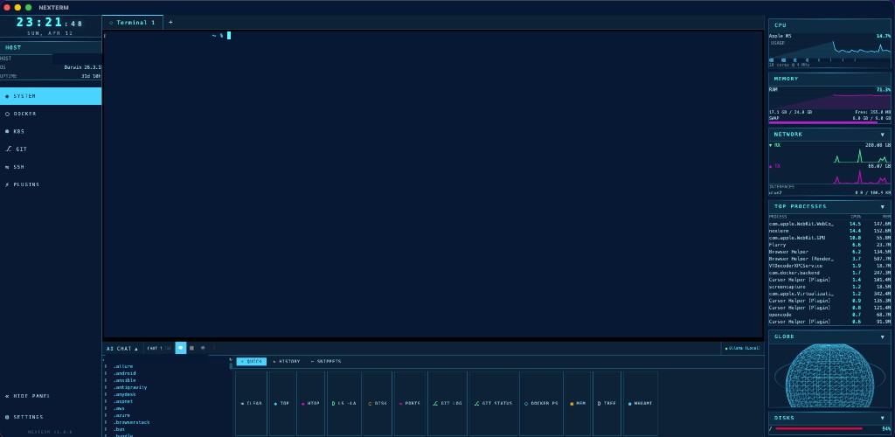
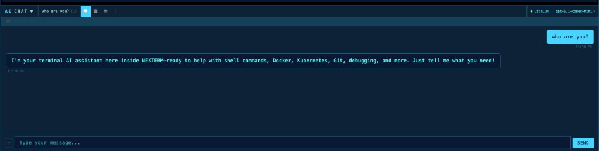

# NEXTERM

> A next-generation, AI-powered terminal emulator and DevOps command center with a sci-fi interface.

**NEXTERM** is a fullscreen, cross-platform desktop application that brings together terminal emulation, system monitoring, Docker & Kubernetes management, Git visualization, SSH connections, and AI-assisted workflows — all in a single, visually striking interface inspired by science fiction.

Built from the ground up as a spiritual successor to [eDEX-UI](https://github.com/GitSquared/edex-ui), NEXTERM reimagines the concept with modern technologies and a focus on real-world DevOps productivity.

---

## Screenshots




---

## Why NEXTERM?

The original [eDEX-UI](https://github.com/GitSquared/edex-ui) by [@GitSquared](https://github.com/GitSquared) was a beautiful sci-fi terminal emulator inspired by TRON Legacy. It captured the imagination of developers worldwide but was archived in 2023. NEXTERM picks up where it left off:

| | eDEX-UI | NEXTERM |
|---|---------|---------|
| **Framework** | Electron | Tauri v2 (Rust) |
| **Frontend** | Vanilla JS | Svelte 5 + TypeScript |
| **Memory** | ~500MB+ | ~80MB |
| **AI** | — | Multi-provider chat (LiteLLM, OpenAI, Anthropic, Ollama) |
| **Docker** | — | Full container & image management |
| **Kubernetes** | — | Context switching, pods, deployments, services |
| **Git** | — | Branch graph, status, diff viewer |
| **SSH** | — | Profile manager with private key support |
| **Terminal** | Single | Multi-tab with rename, exec into containers/pods |

---

## Features

### Terminal
- Multi-tab terminal emulator (up to 5 tabs) powered by **xterm.js** with WebGL rendering
- **Tab renaming** — double-click any tab to rename it
- **Command History** panel with quick actions and snippet library
- Automatic CWD tracking via OSC 7 + fallback process inspection

### AI Chat
- **Multi-provider support** — LiteLLM Proxy, OpenAI, Anthropic, Ollama, or any OpenAI-compatible endpoint
- **Model auto-discovery** — automatically fetches available models from `/model/info` and `/v1/models`
- **4 Chat Modes:** Chat, Plan, Agent, Ask
- **Multi-session** — Create, switch between, and manage multiple conversations
- **Model switching** — Change models on-the-fly from the chat header
- **Command extraction** — Code blocks in responses get ▶ RUN buttons to execute directly in terminal
- **opencode.json import** — Import provider configs from [OpenCode](https://opencode.ai)

### Intel Hub
- Interactive **3D Globe** (Three.js) with network-reactive animations
- **Command Heatmap** — categorized visualization of recent terminal commands (Git, Docker/K8s, Pkg, Net, Sys)
- **Network Radar** — real-time interface traffic and top active connections
- **Security Watch** — alerts for suspicious command patterns and high CPU processes

### System Monitoring
- Real-time **CPU** usage chart (per-core)
- **Memory** usage with swap tracking
- **Disk** usage with color-coded capacity bars
- **Network** throughput (RX/TX) live chart
- **Top Processes** table
- All panels are independently collapsible

### Docker
- Container list with state indicators (running/stopped/paused)
- **Start**, **Stop**, **Restart**, **Remove** actions per container
- **Shell into container** — opens a new terminal tab with `docker exec -it`
- Image list with size info and **Delete** capability

### Kubernetes
- **Context switcher** — list and switch between kubeconfig contexts
- **Namespace selector** — filter resources by namespace
- **Pods** — status, ready count, restarts, age, node info with SH/LOG/Delete actions
- **Deployments** — ready replicas, inline **scale** control, **rollout restart**
- **Services** — type, cluster IP, external IP, ports

### Git
- **Branch list** with current branch indicator
- **Commit log** with hash, author, date
- **Status** — staged, modified, untracked files
- **Auto-sync with terminal CWD**

### SSH
- Save connection profiles with **host, port, username, auth method**
- **Private key path** support
- **Connect** button opens a new terminal tab with SSH

### Appearance
- 5 built-in themes: **Tron** (default), **Blade**, **Matrix**, **Nord**, **Cyberpunk**
- Adjustable font size and sound effects

---

## Tech Stack

| Layer | Technology |
|-------|-----------|
| Desktop Shell | **Tauri v2** (Rust backend) |
| Frontend | **Svelte 5** + TypeScript |
| Build | **Vite 6** |
| Terminal | **xterm.js v5** + WebGL renderer |
| System Info | `sysinfo` (Rust) |
| Docker | `bollard` (Rust) |
| Git | `git2` (Rust) |
| Kubernetes | `kubectl` CLI (JSON parsing) |
| AI Chat | Direct HTTP (`fetch`) to OpenAI-compatible APIs |
| 3D Globe | **Three.js** |

---

## Install

### Homebrew (macOS — recommended)

```bash
brew tap musanmaz/nexterm
brew install --cask nexterm
```

This installs NEXTERM as a proper macOS `.app` bundle in `/Applications`.

### Manual Download

Download the latest `.dmg` from the [Releases](https://github.com/musanmaz/nexterm/releases) page:

1. Open `NEXTERM-1.0.0-arm64.dmg`
2. Drag **NEXTERM.app** to Applications
3. Launch from Spotlight or Launchpad

### Build from Source

```bash
git clone https://github.com/musanmaz/nexterm.git
cd nexterm
npm install
npm run tauri build
```

The built `.app` will be at `src-tauri/target/release/bundle/macos/NEXTERM.app`.

---

## Development

```bash
npm install
npm run tauri dev
```

### Prerequisites

- [Rust](https://rustup.rs/) (1.70+)
- [Node.js](https://nodejs.org/) (18+)
- Platform dependencies for Tauri: see [Tauri prerequisites](https://v2.tauri.app/start/prerequisites/)
- (Optional) Docker for container management
- (Optional) `kubectl` for Kubernetes features

---

## AI Setup

1. Open **Settings** (⚙ in sidebar or `Ctrl+,`)
2. Go to **PROVIDERS** tab
3. Click **+ ADD**, select provider type
4. Enter Base URL and API Key
5. Click **⚡ TEST CONNECTION** to verify
6. Click **↻ DISCOVER MODELS** to auto-fetch available models
7. Select a model and **SAVE**

Or import from OpenCode: click **📋 IMPORT FROM OPENCODE.JSON** and paste your config.

---

## Project Structure

```text
nexterm/
├── src-tauri/                 # Rust backend
│   └── src/
│       ├── lib.rs             # Tauri app setup + command registration
│       ├── pty/               # PTY session management
│       ├── system/            # System monitoring
│       ├── docker/            # Docker management
│       ├── kubernetes/        # Kubernetes operations via kubectl
│       ├── git/               # Git operations (libgit2)
│       ├── ssh/               # SSH profile storage
│       └── ai/                # AI provider integration
├── src/                       # Svelte frontend
│   ├── lib/
│   │   ├── components/        # UI components
│   │   ├── stores/            # Svelte 5 reactive stores
│   │   ├── utils/             # IPC, AI chat, model discovery
│   │   └── types/             # TypeScript definitions
│   └── routes/                # SvelteKit pages
├── Casks/                     # Homebrew Cask formula
├── Formula/                   # Homebrew formula (legacy)
├── docs/screenshots/          # README screenshots
└── static/                    # Themes, sounds
```

---

## Releases

- **Latest**: [v1.0.0](https://github.com/musanmaz/nexterm/releases/tag/v1.0.0)
- **All Releases**: [github.com/musanmaz/nexterm/releases](https://github.com/musanmaz/nexterm/releases)

## Repository

- **Source**: [github.com/musanmaz/nexterm](https://github.com/musanmaz/nexterm)
- **Homebrew Tap**: [github.com/musanmaz/homebrew-nexterm](https://github.com/musanmaz/homebrew-nexterm)

---

## Credits

- [eDEX-UI](https://github.com/GitSquared/edex-ui) by [@GitSquared](https://github.com/GitSquared) — The original sci-fi terminal emulator
- [Tauri](https://tauri.app) — Lightweight desktop app framework
- [Svelte](https://svelte.dev) — Reactive UI framework
- [xterm.js](https://xtermjs.org) — Terminal emulator component
- [Three.js](https://threejs.org) — 3D graphics
- [LiteLLM](https://litellm.ai) — LLM proxy for unified model access

---

## License

MIT — See [LICENSE](LICENSE)

---

<p align="center">
  <strong>NEXTERM</strong> — Where science fiction meets DevOps.
</p>
